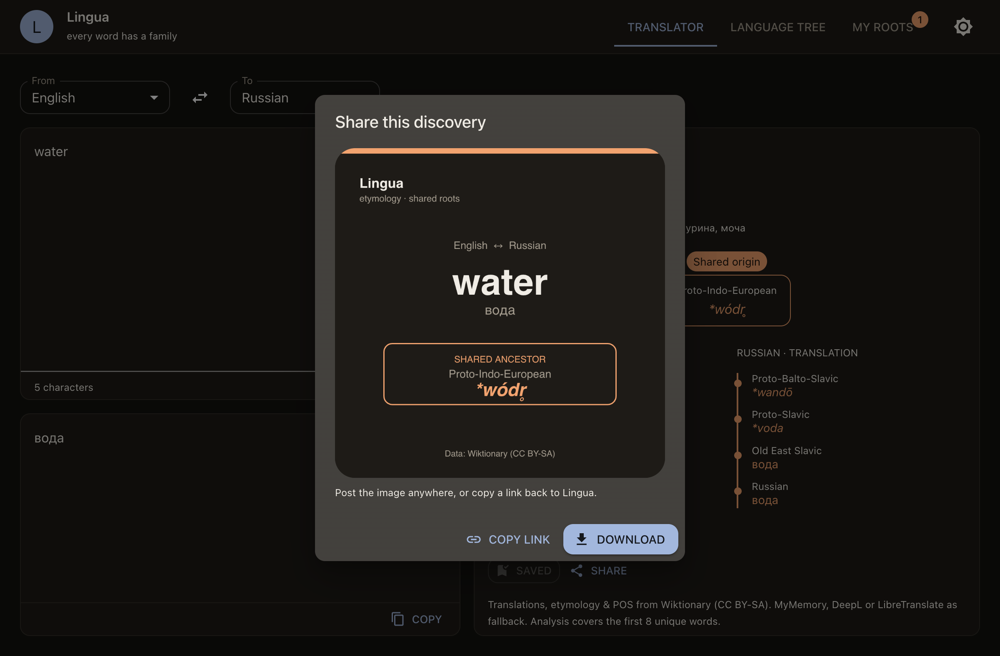

# Lingua

**Every word has a family.** Lingua is an etymology explorer: type a word and see
where it comes from — and who its relatives are across languages. It draws the
etymological tree that links a word and its translation to their common ancestor,
e.g. English **water** ↔ Russian **вода** → Proto-Indo-European `*wódr̥`.

**Live web app:** https://godsdar.github.io/lingua/ — rebuilds and deploys
automatically on every push to `main`.


One shared, platform-agnostic core (`src/core/`) powers three surfaces:

| Surface | Status | Notes |
|---|---|---|
| **Web** (React SPA, no server) | working | `npm run build:web` → `web/dist` |
| **Browser extension** (Chrome MV3) | working | `npm run build:ext` → `extension/dist` |
| **Desktop** (Electron) | working | `npm run dist:mac` / `dist:win` / `dist:linux` |

## Features

- **Instant translation** as you type (no button, debounced).
- **Word-by-word analysis**: part of speech, target-language gloss, alternatives.
- **Etymological tree**: source word ↔ translation, meeting at their shared ancestor.
- **Static Indo-European family tree**, with the app's four languages highlighted.
- **My roots**: a local “roots discovered” collection (no account).
- **Share**: export the tree as an image (PNG) or copy a permalink.



## Quick start

```sh
npm ci
npm run dev          # desktop app in dev mode (HMR)
```

## Commands

| Command | Description |
|---|---|
| `npm run dev` | Electron + Vite HMR |
| `npm run typecheck` | types for node and web contexts |
| `npm run build` | production desktop build |
| `npm run preview` | run the built desktop app |
| `npm run build:ext` | build the browser extension → `extension/dist` |
| `npm run dev:web` / `build:web` | web app (dev / `web/dist`) |
| `npm run dist:mac` / `dist:win` / `dist:linux` | installers → `release/` |

### Docker

```sh
docker build -t lingua-web .            # build + serve the web app
docker run --rm -p 8080:80 lingua-web   # open http://localhost:8080
docker build --target ci -t lingua-ci . # typecheck + build all surfaces
```

## Testing

```sh
npm test     # node --test — etymology tree building (src/core/etymologyTree.test.ts)
```

The tree builder is a pure function, so it is tested without a browser or network:
shared-ancestor trunk/divergence shape, word normalization (`*` and case), and the
unrelated-words case.

## Architecture

```
src/core/        shared core (etymology, translation, analysis) — web APIs only
src/main/        Electron main + IPC
src/preload/     contextBridge
src/renderer/    UI (React + MUI), reused by the web app and extension
extension/       Chrome MV3 (popup + context menu)
web/             web entry (browser adapter for the core, no server)
docs/            DESIGN.md, PIPELINE.md, POSITIONING.md, decisions/ (ADR)
```

The core runs unchanged in Node (desktop) and in the browser (web, extension).
Wiktionary supports CORS (`origin=*`) and MyMemory is CORS-enabled, so no backend
is required.

## Install the unsigned macOS build

The app is not code-signed yet. After downloading the `.dmg` and moving it to
`/Applications`, clear the quarantine flag:

```sh
xattr -dr com.apple.quarantine /Applications/Lingua.app
```

## Better translation (optional)

By default translations come from Wiktionary with a MyMemory fallback. For higher
quality set one of these environment variables: `DEEPL_API_KEY` or
`LIBRETRANSLATE_URL`.

## Development notes (AI-assisted)

Large parts of the first draft were generated with AI agents, then reviewed and
corrected by hand against real Wiktionary data:

- Work starts from a written design and ADRs (`docs/DESIGN.md`, `docs/decisions/`)
  before any code is generated.
- The shared core (`src/core/`) is kept free of Electron/browser APIs so the same
  code runs in Node, the browser and the extension.
- Verification is automated: `npm run typecheck` plus `npm test` on the pure tree
  builder, and CI builds all three surfaces. Visual/UX behaviour is checked in the
  running app.

## Data & license

Etymology, part of speech and translations come from
[English Wiktionary](https://en.wiktionary.org) under **CC BY-SA**; attribution is
shown in the app. The source code is MIT (see [LICENSE](LICENSE)).

## Documentation

- [Agent guide (AGENTS.md)](AGENTS.md)
- [Design document & UX scenarios](docs/DESIGN.md)
- [Positioning, hook and growth](docs/POSITIONING.md)
- [Pipeline, distribution, first users](docs/PIPELINE.md)
- [Architecture decisions (ADR)](docs/decisions/)
