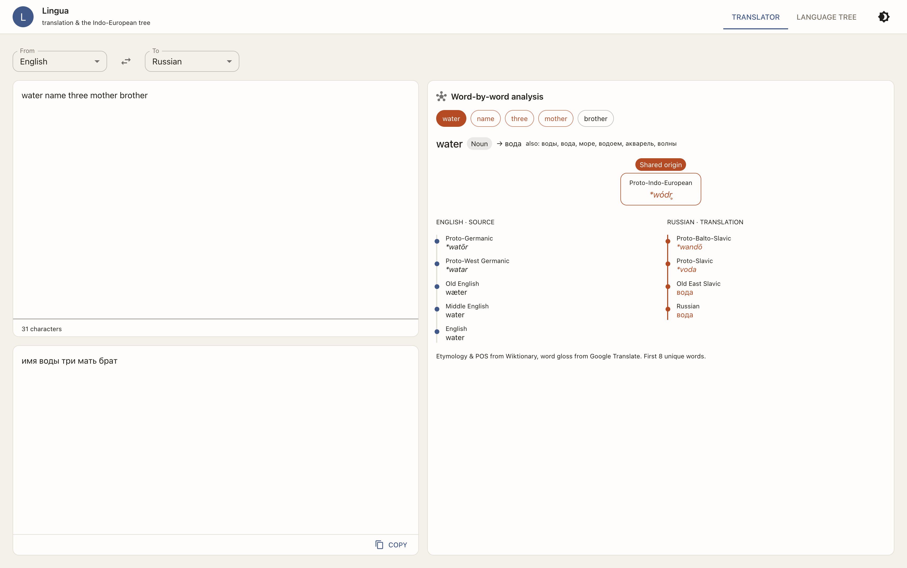

# Lingua

An etymology explorer: type a word and see where it came from and which words share the same ancestor.



Live demo: https://godsdar.github.io/lingua/

## What it does

- Translates as you type, with no button.
- Shows a word-by-word analysis: part of speech, gloss, alternatives.
- Builds an etymological tree that links two words to their shared ancestor.
- Runs one shared core across a web app, a Chrome extension and an Electron desktop app.
- Saves a local "roots discovered" list and exports a tree as an image.

## Stack

TypeScript, React, MUI, d3-hierarchy, Electron, Vite, `node --test`.

## Run it

```bash
npm ci
npm run dev        # desktop app in dev mode
npm test           # tree builder tests
npm run build:web  # web build
```

## What was hard

Keeping one core that runs unchanged in Node (desktop) and in the browser (web,
extension) forced every platform detail out of the core and behind a small
adapter. The tree builder was the other tricky part: shared ancestors mean the
two lineages merge into one trunk and split again, and the tests now pin that
shape, the word normalisation and the unrelated-words case.
